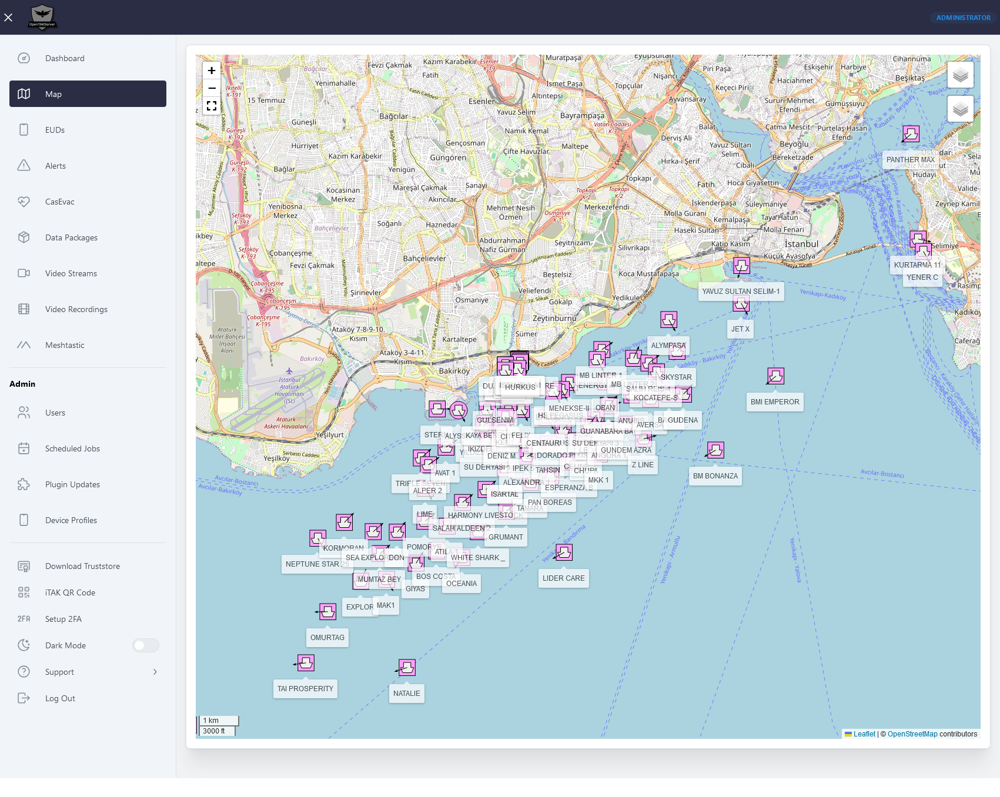

# AIS

***

OpenTAKServer can pull live AIS data from the [AISHub.net](https://www.aishub.net/). Vessels will be shown on your EUD's
map and OpenTAKServer's map. You can find it under Scheduled Jobs in the UI.

## AISHub API

***

You will need an account on AISHub with API access. Generally this requires that you setup an AIS feeder and share your data with them.
When querying the API, they limit requests to no more than one per minute. Keep this in mind when setting the query interval.

## Settings

***

`OTS_AISHUB_USERNAME` is the only required setting, the rest are optional. However, it's a good idea to only query a small geographical
area or only a few specific vessels (or both). If you don't set a location or specific vessels to query, AISHub will return all
its data, and you could end up with more than 50,000 points on your EUDs.

When querying a geographic location you are specifying a rectangle to search within. You'll need two points, the southwestern
corner and the northeastern corner.

See [AISHub's API docs](https://www.aishub.net/api) for more details.

- `OTS_AISHUB_USERNAME`
- `OTS_AISHUB_SOUTH_LAT` - Latitude of the southwest corner
- `OTS_AISHUB_WEST_LON` - Longitude of the southwest corner
- `OTS_AISHUB_NORTH_LAT` - Latitude of the northeast corner
- `OTS_AISHUB_EAST_LON` - Longitude of the northeast corner
- `OTS_AISHUB_MMSI_LIST` - A comma-separated string of MMSI numbers of specific vessels to search, for example `"367658140,366902120"`
- `OTS_AISHUB_IMO_LIST` - A comma-separated string of IMO numbers of specific vessels to search, for example `"1234,5678"`

## Screenshot

***

