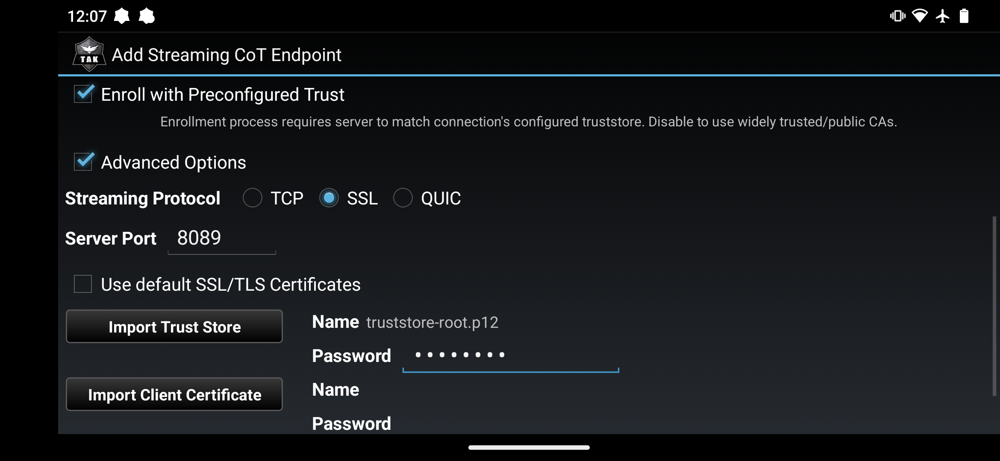
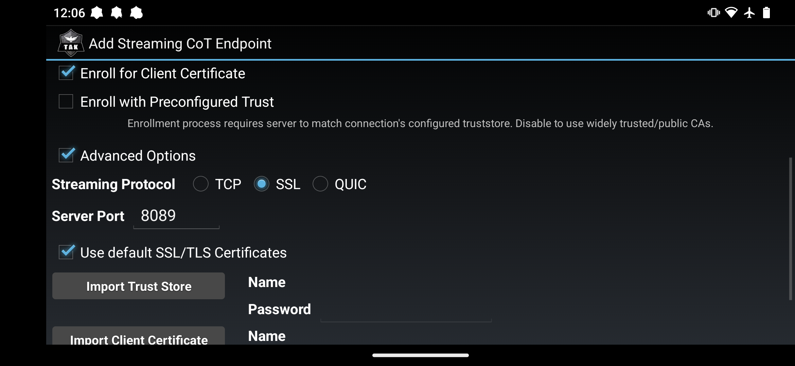

# Certificate Enrollment
***
OpenTAKServer supports client certificate enrollment which defaults to port `8446`.

## Authentication
***
Certificate enrollment requires authentication. You will need to register an account on your OpenTAKServer or
have an administrator make an account for you.

## Prerequisites
***
The default port for certificate enrollment is `8446`. This port will use one of two types of certificates, self-signed 
or Let's Encrypt. The default is to use self-signed certificates. If your server uses self-signed certificates, you will need
a copy of your server's truststore certificate for auto-enrollment. You can download a copy at 
`https://your_server_address/api/truststore`.

## iTAK QR Code
***
In order to use a QR code for iTAK enrollment, your server must be configured with a signed certificate from Let's Encrypt
or a similar trusted certificate authority.

## Instructions
***
1. On the main ATAK screen, tap the hamburger icon in the top right corner and tap `Settings`
2. Tap on `Network Preferences`
3. Tap on `TAK Servers`
4. Tap the three vertical dots button in the top right corner and tap `Add`
5. Fill out your server's name and address
6. Check the `Use Authentication` checkbox and enter your OpenTAKServer username and password
7. Check the `Enroll for Client Certificate` checkbox
8. Make sure Streaming Protocol is set to `SSL`
9. The default server port is `8089` unless OpenTAKServer has been configured to use a different port. Ask your server's admin if you are unsure
10. Use default SSL/TLS Certificates
    1. Self-signed certificates (This is the most common setup)
        1. If your OpenTAKServer is using self-signed certificates, uncheck `Use default SSL/TLS Certificates`
        2. Tap the Import Trust Store button and find your trust store file.
        3. In the password field next to that button, type your trust store certificate's password. The default is `atakatak`
        4. Tap OK
    2. Let's Encrypt Certificates
        1. Leave `Use default SSL/TLS Certificates` checked
11. Tap the `Ok` button at the bottom of the screen
12. After a few seconds you should see a message that registration has succeeded, and you will be automatically connected to the server

### Screenshots

***

#### Self-Signed Certificate Settings

#### Let's Encrypt Settings

